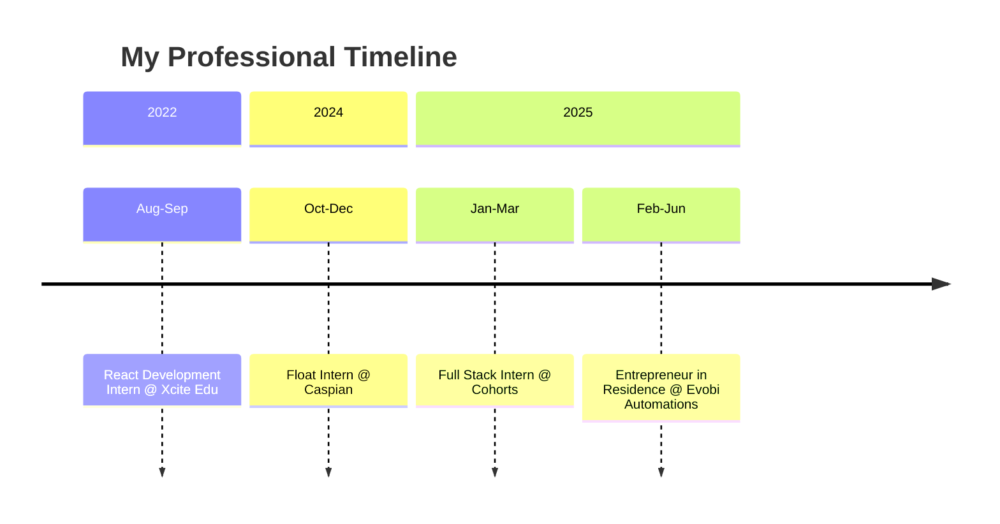

<h1 align="center">👋 Hey there! I'm Harish S</h1>

<p align="center">
  
</p>

<p align="center">
  
</p>

---

## 🚀 About Me

```js
const harish = {
  location: "Mysuru, Karnataka, India 🇮🇳",
  education: "BE - Computer Science & Engineering @ ATME College",
  currentRole: "Entrepreneur in Residence @ Evobi Automations",
  code: ["JavaScript", "Python", "C++", "TypeScript"],
  technologies: {
    frontend: ["React", "Next.js", "HTML5", "CSS3", "Tailwind CSS"],
    backend: ["Node.js", "Express.js", "GraphQL"],
    databases: ["PostgreSQL", "MySQL", "MongoDB"],
    tools: ["Git", "Docker", "Vercel", "Postman"]
  },
  currentlyBuilding: "AI-powered MCP marketplace tools 🤖",
  funFact: "I love contributing to citizen science projects! 🔭"
};
```
## 🎯 What I'm Up To

| Activity | Description |
|----------|-------------|
| 🏢 Currently | Entrepreneur in Residence @ Evobi Automations |
| 🔭 Building | 7cents – AI MCP Tools Marketplace |
| 🌟 Learning | Advanced AI/ML and Cloud Architecture |
| 💡 Exploring | Web3 and Blockchain technologies |
| 🎓 Studying | BE Computer Science @ ATME College (CGPA: 8.2) |
| 📫 Reach me | gowdaharish580@gmail.com |
| 💼 Connect | [LinkedIn](https://www.linkedin.com/in/harish-sathish-82ba21266/) |

<p align="center">
  
</p>

---

## 🛠️ Tech Stack & Tools

### 💻 Languages
<p align="center">
  
</p>

### 🌐 Frontend
<p align="center">
  
</p>

### 🔙 Backend
<p align="center">
  
</p>

### 🗄 Databases
<p align="center">
  
</p>

### ⚙️ Tools & Platforms
<p align="center">
  
</p>

---

## 🔥 Featured Projects

### 🛒 7cents - AI MCP Tools Marketplace  
A marketplace for MCP tools where users subscribe to powerful tools that enable AI to perform real tasks and boost productivity.  
**Tech Stack:** Next.js • PostgreSQL • Express.js

---

### 🎤 Port11 - AI Interview Platform  
AI-powered interview platform developed at Evobi Automations.  
**Role:** Product Strategy • MVP Development • Business Growth

---

### 🔭 Astronomy Log - Citizen Science Project  
Platform for logging astronomical observations and collecting data for research purposes.  
**Tech Stack:** Next.js • PostgreSQL • Express.js • GraphQL

---

## 📊 GitHub Stats

<p align="center">
  
  
</p>

---

## 🔥 GitHub Streak

<p align="center">
  
</p>

---

## 🏆 GitHub Trophies

<p align="center">
  
</p>

---

## 🐍 Contribution Graph

<p align="center">
  
</p>

---

## 💼 Professional Journey


