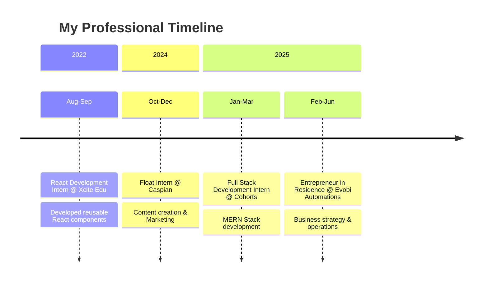

````markdown
<h1 align="center">👋 Hey there! I'm Harish S</h1>

<div align="center">
  
</div>

<div align="center">
  
</div>

---

## 🚀 About Me

```javascript
const harish = {
  location: "Mysuru, Karnataka, India 🇮🇳",
  education: "BE - Computer Science & Engineering @ ATME College",
  currentRole: "Entrepreneur in Residence @ Evobi Automations",
  code: ["JavaScript", "Python", "C++", "TypeScript"],
  technologies: {
    frontend: ["React", "Next.js", "HTML5", "CSS3", "Tailwind CSS"],
    backend: ["Node.js", "Express.js", "GraphQL"],
    databases: ["PostgreSQL", "MySQL", "MongoDB"],
    tools: ["Git", "Docker", "Vercel", "Postman"]
  },
  currentlyBuilding: "AI-powered MCP marketplace tools 🤖",
  funFact: "I love contributing to citizen science projects! 🔭"
};
````

---

## 🎯 What I'm Up To


* 🏢 **Currently**: Entrepreneur in Residence at Evobi Automations
* 🔭 **Building**: 7cents - AI MCP Tools Marketplace
* 🌟 **Fun Facts About Me**: Learning advanced AI/ML and cloud architecture
* 💡 **Exploring**: Web3 and Blockchain technologies
* 🎓 **Studying**: Computer Science @ ATME College (CGPA: 8.2)
* 📫 **Reach me**: [gowdaharish580@gmail.com](mailto:gowdaharish580@gmail.com)
* 💼 **Connect**: [LinkedIn](https://www.linkedin.com/in/harish4dev)

<br clear="right"/>

---

## 🛠️ Tech Stack & Tools

<div align="center">
  <strong>Languages</strong><br>
  <br><br>

<strong>Frontend</strong><br> <br><br>

<strong>Backend</strong><br> <br><br>

<strong>Databases</strong><br> <br><br>

<strong>Tools & Platforms</strong><br> 

</div>

---

## 🔥 Featured Projects

<div align="center">

### 🛒 7cents - AI MCP Tools Marketplace

A marketplace for MCP tools where users subscribe to powerful tools that enable AI to perform real tasks and boost productivity.
**Tech Stack**: Next.js • PostgreSQL • Express.js

### 🎤 Port11 - AI Interview Platform

AI-powered interview platform developed at Evobi Automations. Worked as EIR to shape MVP and business strategy.
**Role**: Product Strategy • MVP Development • Business Growth

### 🔭 Astronomy Log - Citizen Science Project

Platform for logging astronomical observations and collecting data for research purposes.
**Tech Stack**: Next.js • PostgreSQL • Express.js • GraphQL

</div>

---

## 📊 GitHub Stats

<div align="center">
  
  
</div>

## 🔥 GitHub Streak

<div align="center">
  
</div>

## 🏆 GitHub Trophies

<div align="center">
  
</div>

## 🐍 Contribution Graph

<div align="center">
  
</div>

---

## 💼 Professional Journey



---

## 🎨 Activity Graph

<div align="center">
  
</div>

---

## 🎵 Currently Vibing To

<div align="center">
  
</div>

---

## 🤝 Connect With Me

<div align="center">
  <a href="https://www.linkedin.com/in/harish4dev"></a>
  <a href="mailto:gowdaharish580@gmail.com"></a>
  <a href="https://github.com/harish4dev"></a>
</div>

<br>

<div align="right">
  
</div>

---

✨ I'm passionate about citizen science and astronomy
🚀 Love working on AI-powered applications
🎮 Enjoy building interactive web experiences
📚 Always learning new technologies

```
```
